# Use Cases

## 0. System Purpose

A private, lightweight, and frictionless administrative system designed for a small-scale custom sewing and embroidery workshop. The system combines an AI-driven Telegram interface to eliminate technical friction with a clean Streamlit dashboard for monitoring business operations.

The system is designed for a single business owner (`OWNER`) who delegates administrative and financial work to an assistant. The system does NOT replace the user: it removes technical friction.

### Surfaces

- **Telegram Bot (OWNER)** — quick interactions, notifications, Google identity linking.
- **Telegram Bot (SYSADMIN)** — a separate instance, on a separate phone, for abuse alerts and administrative commands.
- **Streamlit Dashboard** — Kanban board, time logging (future), health verification.
- **KissyEngine** — in-process orchestrator: owns the bot, the inference client, the Invoice Ninja client, and the SQLite database.
- **Inference Provider** — interface; current implementation = Ollama on a private LAN; future = OpenAI / Google.
- **Invoice Ninja** — system of record for clients, invoices, tasks, projects, payments.
- **SQLite** — persistence for `conversations`, `audit_log`, `healthchecks`, `claims`.
- **Scheduler** — cron / APScheduler; drives the daily/weekly summary, idle-close sweeps, and retention purges.

## 1. Actors

| ID | Actor | Description |
|---|---|---|
| `OWNER` | Business owner | Single user; phone allowlisted. |
| `SYSADMIN` | System administrator | Separate phone, separate bot; receives abuse alerts. |
| `TG_OWNER` | Telegram platform (OWNER bot) | Delivers webhooks; supports inline keyboards. |
| `TG_ADMIN` | Telegram platform (SYSADMIN bot) | Same; separate from the OWNER bot. |
| `NINJA` | Invoice Ninja API | System of record. |
| `INFERENCE` | Inference Provider | Extracts structured intent (Ollama today; OpenAI/Google tomorrow). |
| `SCHEDULER` | Cron / APScheduler | Daily/weekly summary, purges, idle close. |

## 2. Conventions

Each use case follows the same template, in this order:

- **Goal**
- **Actors**
- **Preconditions**
- **Main flow**
- **Alt / exception flows**
- **Security & policy notes**
- **Sequence diagram** (mermaid, complete)

All diagrams are `sequenceDiagram` blocks with autonumbering. Participant names follow the actor catalog (`OWNER`, `TG_OWNER`, `KissyEngine`, `INFERENCE`, `NINJA`, `SQLite`, `Scheduler`, `Streamlit`, `TG_ADMIN`, `SYSADMIN`).

Cross-cutting conventions:

- Every write (POST/PATCH) against Ninja requires explicit confirmation via a Telegram inline keyboard, unless the use case states otherwise.
- The LLM contract is: strict JSON `{intent, params, confidence}` validated against a schema. The code-level dispatcher is the ONLY path to Ninja; the LLM never calls endpoints directly.
- Write confirmations always use `Confirmar` and `Editar` buttons (Spanish, as shipped to the user). `Cancelar` does not appear in composite flows (UC-T-W11); instead, `Editar` opens "¿Qué quieres cambiar?" (Spanish, as shipped).
- Every write produces a row in `audit_log` with `actor`, `intent`, `params`, `result`, `ts`. Composite writes share a `correlation_id`.
- Language: Spanish on all user-facing surfaces; English on this and other engineering documentation.

---

## 3. Telegram — Read (5)

### UC-T-R01 · List clients

- **Goal:** `OWNER` obtains a client list (with optional filter by name).
- **Actors:** `OWNER`, `TG_OWNER`, `KissyEngine`, `INFERENCE`, `NINJA`.
- **Preconditions:** `OWNER`'s phone is allowlisted; bot is healthy.
- **Main flow:**
  1. `OWNER` sends a free-text message (e.g. "muéstrame los clientes de Acme").
  2. `KissyEngine` loads the conversation context (≤20 messages).
  3. `INFERENCE` returns `{intent: "list_clients", params: {query}, confidence}`.
  4. The dispatcher validates the schema and resolves to `GET /api/v1/clients?filter=...`.
  5. `KissyEngine` renders a paginated list with inline buttons (next page, view detail).
- **Alt / exception flows:**
  - `confidence < threshold` → bot asks for clarification.
  - `NINJA` 5xx → "no pude consultar Ninja ahora, intenta en un momento".
  - Rate limit exceeded → 429 + "demasiadas solicitudes".
  - Empty result → "no encontré clientes con ese filtro".
- **Security & policy notes:**
  - Read-only; no confirmation needed.
  - PII (email, phone) is masked unless `OWNER` explicitly asks "muéstrame el email".
  - Explanation sub-behavior: if `OWNER` follows up with "¿qué significa X?", the bot explains the Ninja term in plain Spanish.
- **Diagram:**

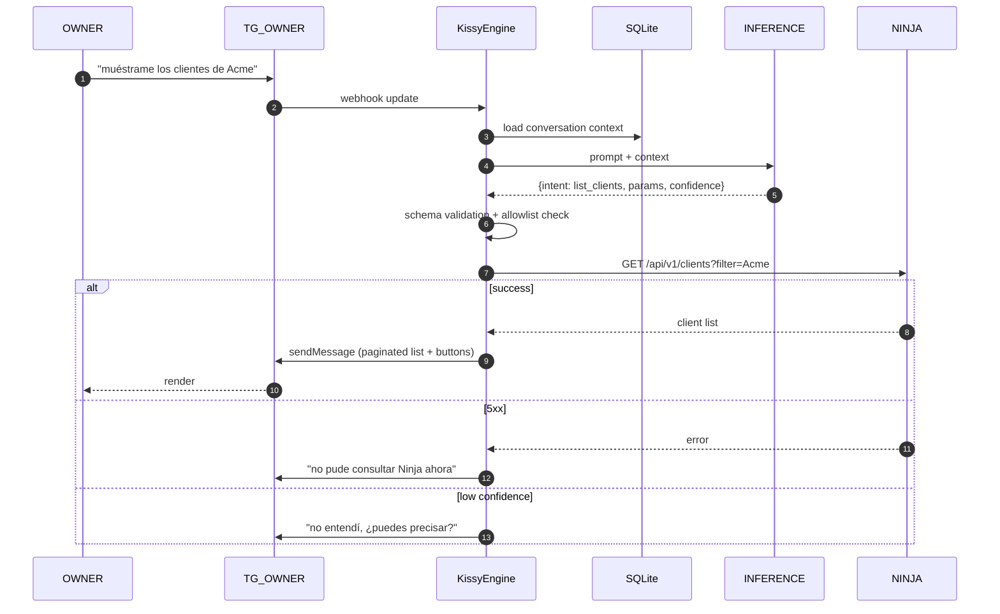
```mermaid
sequenceDiagram
    autonumber
    participant O as OWNER
    participant T as TG_OWNER
    participant K as KissyEngine
    participant DB as SQLite
    participant I as INFERENCE
    participant N as NINJA

    O->>T: "muéstrame los clientes de Acme"
    T->>K: webhook update
    K->>DB: load conversation context
    K->>I: prompt + context
    I-->>K: {intent: list_clients, params, confidence}
    K->>K: schema validation + allowlist check
    K->>N: GET /api/v1/clients?filter=Acme
    alt success
        N-->>K: client list
        K->>T: sendMessage (paginated list + buttons)
        T-->>O: render
    else 5xx
        N-->>K: error
        K->>T: "no pude consultar Ninja ahora"
    else low confidence
        K->>T: "no entendí, ¿puedes precisar?"
    end
```

### UC-T-R02 · Look up invoice

- **Goal:** retrieve an invoice by number, by client, or "the latest".
- **Actors:** `OWNER`, `TG_OWNER`, `KissyEngine`, `INFERENCE`, `NINJA`.
- **Preconditions:** allowlist; bot healthy.
- **Main flow:**
  1. `OWNER` sends a free-text message referencing an invoice.
  2. `INFERENCE` returns `{intent: "get_invoice", params: {invoice_number|client|recent}}`.
  3. `KissyEngine` resolves `GET /api/v1/invoices/{id}` (or runs a search).
  4. Renders a summary: status, total, balance, due date, with inline buttons: `Marcar pagada` → UC-T-W05; `Ver pagos` → UC-T-R04.
- **Alt / exception flows:**
  - Not found → bot asks for more detail.
  - Multiple matches → inline keyboard of candidates.
  - Sub-behavior: if asked to explain a status (`draft`, `sent`, `paid`, `overdue`, `cancelled`), the bot explains it in Spanish.
- **Security & policy notes:**
  - Read-only.
  - Sensitive buttons (unapply payment) only appear once an invoice is uniquely resolved.
- **Diagram:**

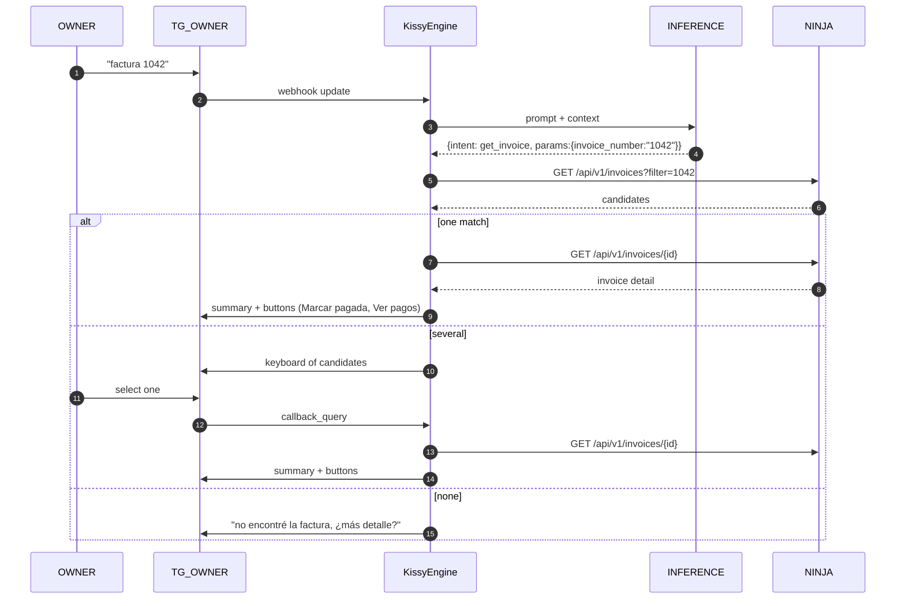
```mermaid
sequenceDiagram
    autonumber
    participant O as OWNER
    participant T as TG_OWNER
    participant K as KissyEngine
    participant I as INFERENCE
    participant N as NINJA

    O->>T: "factura 1042"
    T->>K: webhook update
    K->>I: prompt + context
    I-->>K: {intent: get_invoice, params:{invoice_number:"1042"}}
    K->>N: GET /api/v1/invoices?filter=1042
    N-->>K: candidates
    alt one match
        K->>N: GET /api/v1/invoices/{id}
        N-->>K: invoice detail
        K->>T: summary + buttons (Marcar pagada, Ver pagos)
    else several
        K->>T: keyboard of candidates
        O->>T: select one
        T->>K: callback_query
        K->>N: GET /api/v1/invoices/{id}
        K->>T: summary + buttons
    else none
        K->>T: "no encontré la factura, ¿más detalle?"
    end
```

### UC-T-R03 · Pending tasks / open projects

- **Goal:** quick view of active tasks and projects.
- **Actors:** `OWNER`, `TG_OWNER`, `KissyEngine`, `INFERENCE`, `NINJA`.
- **Preconditions:** allowlist; bot healthy.
- **Main flow:**
  1. `OWNER` asks "tareas pendientes" or "proyectos abiertos".
  2. `INFERENCE` classifies as `list_tasks` or `list_projects`.
  3. `KissyEngine` calls the corresponding endpoint (`status_id` filtered to active).
  4. Renders the list with inline buttons: `Ver detalle`, `Mover` (UC-T-W08).
- **Alt / exception flows:** low `confidence` → disambiguation. Sub-behavior: if asked to explain a status, the bot explains it.
- **Security & policy notes:** read-only.
- **Diagram:**

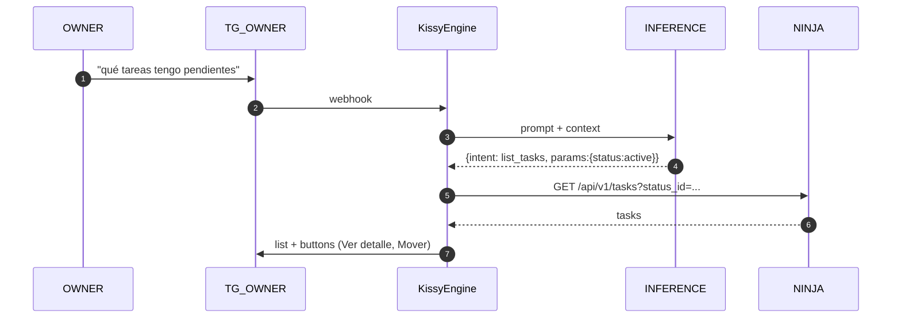
```mermaid
sequenceDiagram
    autonumber
    participant O as OWNER
    participant T as TG_OWNER
    participant K as KissyEngine
    participant I as INFERENCE
    participant N as NINJA

    O->>T: "qué tareas tengo pendientes"
    T->>K: webhook
    K->>I: prompt + context
    I-->>K: {intent: list_tasks, params:{status:active}}
    K->>N: GET /api/v1/tasks?status_id=...
    N-->>K: tasks
    K->>T: list + buttons (Ver detalle, Mover)
```

### UC-T-R04 · View payments for a client or invoice

- **Goal:** payment history.
- **Actors:** `OWNER`, `TG_OWNER`, `KissyEngine`, `INFERENCE`, `NINJA`.
- **Preconditions:** allowlist.
- **Main flow:**
  1. `OWNER` asks about payments (e.g. "pagos del cliente Acme").
  2. `INFERENCE` returns `{intent: "list_payments", params: {client|invoice}}`.
  3. `KissyEngine` resolves the client/invoice (ambiguous → keyboard).
  4. `GET /api/v1/payments?...` → list with aggregated totals.
- **Alt / exception flows:** client/invoice not found → ask for more detail. The `Anular aplicación` button on each payment invokes UC-T-W06.
- **Security & policy notes:** read-only. `Anular aplicación` is the only action available and always requires confirmation.
- **Diagram:**

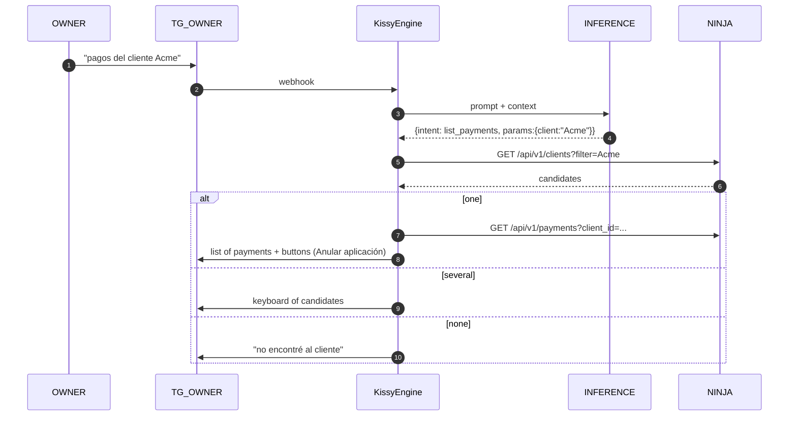
```mermaid
sequenceDiagram
    autonumber
    participant O as OWNER
    participant T as TG_OWNER
    participant K as KissyEngine
    participant I as INFERENCE
    participant N as NINJA

    O->>T: "pagos del cliente Acme"
    T->>K: webhook
    K->>I: prompt + context
    I-->>K: {intent: list_payments, params:{client:"Acme"}}
    K->>N: GET /api/v1/clients?filter=Acme
    N-->>K: candidates
    alt one
        K->>N: GET /api/v1/payments?client_id=...
        K->>T: list of payments + buttons (Anular aplicación)
    else several
        K->>T: keyboard of candidates
    else none
        K->>T: "no encontré al cliente"
    end
```

### UC-T-R05 · Outstanding balances per client

- **Goal:** pending balance aggregated by client.
- **Actors:** `OWNER`, `TG_OWNER`, `KissyEngine`, `INFERENCE`, `NINJA`.
- **Preconditions:** allowlist.
- **Main flow:**
  1. `OWNER` asks "quién me debe".
  2. `INFERENCE` returns `{intent: "outstanding_balances"}`.
  3. `KissyEngine` queries Ninja, aggregates balances per client.
  4. Renders the list ordered (highest balance first) with `Ver facturas` (UC-T-R02) and `Enviar recordatorio` (out of scope for v1 → placeholder).
- **Alt / exception flows:** 5xx error; zero balance → "nadie te debe".
- **Security & policy notes:** read-only.
- **Diagram:**

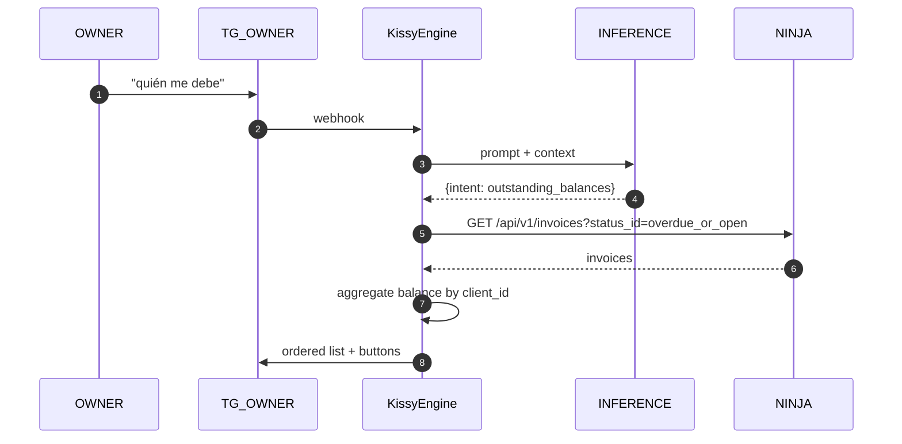
```mermaid
sequenceDiagram
    autonumber
    participant O as OWNER
    participant T as TG_OWNER
    participant K as KissyEngine
    participant I as INFERENCE
    participant N as NINJA

    O->>T: "quién me debe"
    T->>K: webhook
    K->>I: prompt + context
    I-->>K: {intent: outstanding_balances}
    K->>N: GET /api/v1/invoices?status_id=overdue_or_open
    N-->>K: invoices
    K->>K: aggregate balance by client_id
    K->>T: ordered list + buttons
```

---

## 4. Telegram — Write (11)

**General confirmation rule:** every write shows a preview and an inline keyboard with `Confirmar` and `Editar`. Tapping `Editar` makes the bot reply "¿Qué quieres cambiar?" and the dialog continues. There is no `Cancelar` button; closing the dialog or a timeout counts as silent cancellation (nothing executes).

### UC-T-W01 · Create client

- **Goal:** create a new client in Ninja.
- **Actors:** `OWNER`, `TG_OWNER`, `KissyEngine`, `INFERENCE`, `NINJA`.
- **Preconditions:** allowlist; valid schema; mandatory fields complete.
- **Field policy (v1):**
  - **Mandatory:** `name`, `phone`. Bot must collect both before showing the preview.
  - **Strongly suggested (not blocking):** `cedula` (national ID), `address`. The bot asks for each, but if `OWNER` skips them the dialog continues; the missing values are surfaced in the preview as a warning row (e.g. `⚠ sin cédula`, `⚠ sin dirección`) so `OWNER` can fill them via `Editar`.
  - **Optional:** everything else (`email`, `rfc`, notes, etc.).
- **Main flow:**
  1. `OWNER` sends a free-text message.
  2. Multi-turn dialog (≤50 messages; on overflow, see UC-T-L01).
  3. `INFERENCE` returns `{intent: "create_client", params, confidence}`.
  4. Schema validation. If any mandatory field is missing → bot asks for the missing ones in order (`phone` first if absent).
  5. After mandatory fields are satisfied, the bot asks for `cedula` and `address`; if `OWNER` skips either, it proceeds.
  6. Preview with `Confirmar` / `Editar`. Missing suggested fields appear as a warning row in the preview.
  7. `Confirmar` → `POST /api/v1/clients` → summary with id.
- **Alt / exception flows:** `confidence < threshold` → force a clarification round before showing the preview. 30-min timeout → silent close. Concurrent edit → re-fetch and re-preview.
- **Security & policy notes:** fields outside the allowlisted schema are dropped. The warning row in the preview exists for visibility only and does not block confirmation. Audit in `audit_log`.
- **Diagram:**

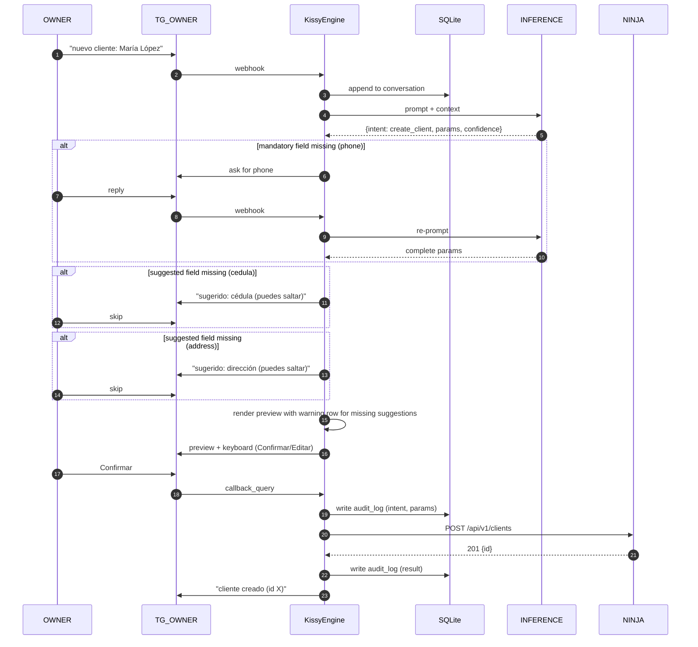
```mermaid
sequenceDiagram
    autonumber
    participant O as OWNER
    participant T as TG_OWNER
    participant K as KissyEngine
    participant DB as SQLite
    participant I as INFERENCE
    participant N as NINJA

    O->>T: "nuevo cliente: María López"
    T->>K: webhook
    K->>DB: append to conversation
    K->>I: prompt + context
    I-->>K: {intent: create_client, params, confidence}
    alt mandatory field missing (phone)
        K->>T: ask for phone
        O->>T: reply
        T->>K: webhook
        K->>I: re-prompt
        I-->>K: complete params
    end
    alt suggested field missing (cedula)
        K->>T: "sugerido: cédula (puedes saltar)"
        O->>T: skip
    end
    alt suggested field missing (address)
        K->>T: "sugerido: dirección (puedes saltar)"
        O->>T: skip
    end
    K->>K: render preview with warning row for missing suggestions
    K->>T: preview + keyboard (Confirmar/Editar)
    O->>T: Confirmar
    T->>K: callback_query
    K->>DB: write audit_log (intent, params)
    K->>N: POST /api/v1/clients
    N-->>K: 201 {id}
    K->>DB: write audit_log (result)
    K->>T: "cliente creado (id X)"
```

### UC-T-W02 · Update client (PATCH)

- **Goal:** partial update of an existing client.
- **Actors:** `OWNER`, `TG_OWNER`, `KissyEngine`, `INFERENCE`, `NINJA`.
- **Preconditions:** client exists; `client_id` uniquely resolved.
- **ID-first clarification (applies to every PATCH in this doc):** `OWNER` typically does not know the Ninja numeric id. When `INFERENCE` cannot extract an explicit id from the message, `KissyEngine` first asks "¿Conoces el id del cliente, o prefieres que lo busquemos por nombre/teléfono?". If `OWNER` says they do not know (or provides a non-numeric reference), `KissyEngine` runs a lookup against Ninja (by name, phone, email, `cedula`, or `rfc`) and, if multiple candidates match, presents them via an inline keyboard for selection. Only after the `client_id` is uniquely identified does the dialog move on to the diff preview.
- **Main flow:**
  1. `OWNER` references a client and a change (e.g. "cambia el teléfono de Acme a 555-9999").
  2. `INFERENCE` returns `{intent: "update_client", params: {match, patch}}`.
  3. If `match` does not contain a numeric id → `KissyEngine` runs the ID-first clarification above (lookup → keyboard if needed).
  4. Diff: fields present vs current.
  5. Preview with `Confirmar` / `Editar`.
  6. `Confirmar` → `PATCH /api/v1/clients/{id}`.
- **Alt / exception flows:** client not found → re-ask. `Editar` → dialog continues.
- **Security & policy notes:** PATCH only; never blanket PUT. Fields outside the schema are dropped. Audit.
- **Diagram:**

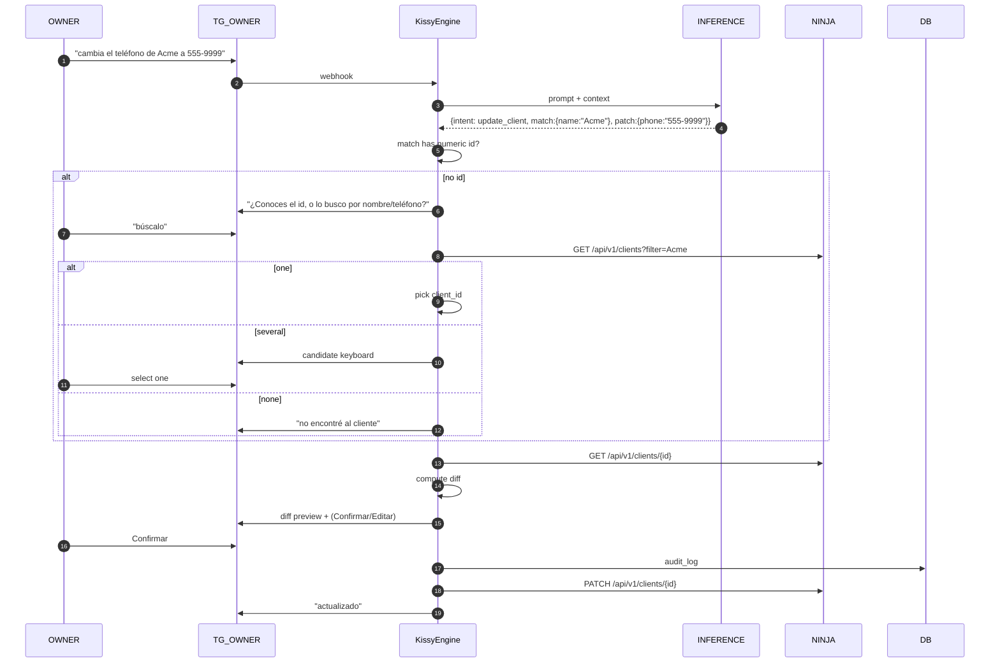
```mermaid
sequenceDiagram
    autonumber
    participant O as OWNER
    participant T as TG_OWNER
    participant K as KissyEngine
    participant I as INFERENCE
    participant N as NINJA

    O->>T: "cambia el teléfono de Acme a 555-9999"
    T->>K: webhook
    K->>I: prompt + context
    I-->>K: {intent: update_client, match:{name:"Acme"}, patch:{phone:"555-9999"}}
    K->>K: match has numeric id?
    alt no id
        K->>T: "¿Conoces el id, o lo busco por nombre/teléfono?"
        O->>T: "búscalo"
        K->>N: GET /api/v1/clients?filter=Acme
        alt one
            K->>K: pick client_id
        else several
            K->>T: candidate keyboard
            O->>T: select one
        else none
            K->>T: "no encontré al cliente"
        end
    end
    K->>N: GET /api/v1/clients/{id}
    K->>K: compute diff
    K->>T: diff preview + (Confirmar/Editar)
    O->>T: Confirmar
    K->>DB: audit_log
    K->>N: PATCH /api/v1/clients/{id}
    K->>T: "actualizado"
```

### UC-T-W03 · Create invoice

- **Goal:** issue a new invoice.
- **Actors:** `OWNER`, `TG_OWNER`, `KissyEngine`, `INFERENCE`, `NINJA`.
- **Preconditions:** client resolved (see UC-T-W11 if client is new); items/amounts/dates ready.
- **Computation policy (v1):**
  - **Server-computed:** `subtotal` and `total` from line items. `OWNER` cannot override these.
  - **Not computed in v1:** taxes. The invoice is created without a tax line. Tax computation is planned for a future version (see cross-cutting notes §13).
- **Main flow:**
  1. `OWNER` describes the invoice (client, items, dates, notes).
  2. Multi-turn dialog; `INFERENCE` returns `{intent: "create_invoice", params, confidence}`.
  3. `KissyEngine` computes `subtotal` and `total` on the server (no taxes in v1) and applies the `due_date`.
  4. Preview with `Confirmar` / `Editar`. The preview explicitly notes `Sin impuestos (calculados en una versión futura)`.
  5. `Confirmar` → `POST /api/v1/invoices`.
- **Alt / exception flows:** server-computed total does not square with line items → bot re-shows the preview with server values. Ambiguous client → keyboard. If `OWNER` mentions taxes, the bot explains that tax computation will be available in a future version.
- **Security & policy notes:** `subtotal`/`total`/`due_date` are server-side; user-supplied values are ignored. Audit.
- **Diagram:**

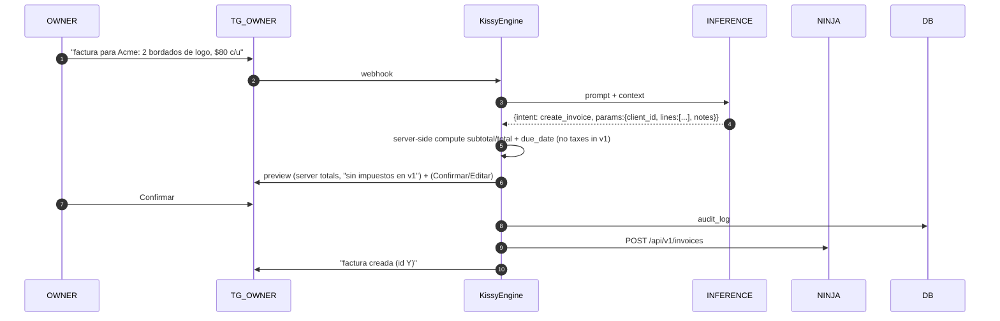
```mermaid
sequenceDiagram
    autonumber
    participant O as OWNER
    participant T as TG_OWNER
    participant K as KissyEngine
    participant I as INFERENCE
    participant N as NINJA

    O->>T: "factura para Acme: 2 bordados de logo, $80 c/u"
    T->>K: webhook
    K->>I: prompt + context
    I-->>K: {intent: create_invoice, params:{client_id, lines:[...], notes}}
    K->>K: server-side compute subtotal/total + due_date (no taxes in v1)
    K->>T: preview (server totals, "sin impuestos en v1") + (Confirmar/Editar)
    O->>T: Confirmar
    K->>DB: audit_log
    K->>N: POST /api/v1/invoices
    K->>T: "factura creada (id Y)"
```

### UC-T-W04 · Update invoice (PATCH)

- **Goal:** partially modify an invoice (due date, notes, lines).
- **Actors:** `OWNER`, `TG_OWNER`, `KissyEngine`, `INFERENCE`, `NINJA`.
- **Preconditions:** invoice exists; coherent diff.
- **ID-first clarification:** same pattern as UC-T-W02. If `OWNER` does not provide the numeric `id`, `KissyEngine` asks whether they know it; if not, it looks the invoice up by `invoice_number`, by client, or by recent list, and disambiguates via inline keyboard when needed.
- **Main flow:**
  1. `OWNER` references the invoice + change (e.g. by `invoice_number` like "1042", by client, or by "the latest").
  2. `INFERENCE` returns `{intent: "update_invoice", params: {match, patch}}`.
  3. If `match` does not contain a numeric id → ID-first clarification.
  4. Diff preview + `Confirmar` / `Editar`.
  5. `PATCH /api/v1/invoices/{id}`.
- **Alt / exception flows:** if the invoice is already `paid`, show a warning before confirmation (editing may require re-assigning payments).
- **Security & policy notes:** PATCH only; audit.
- **Diagram:**

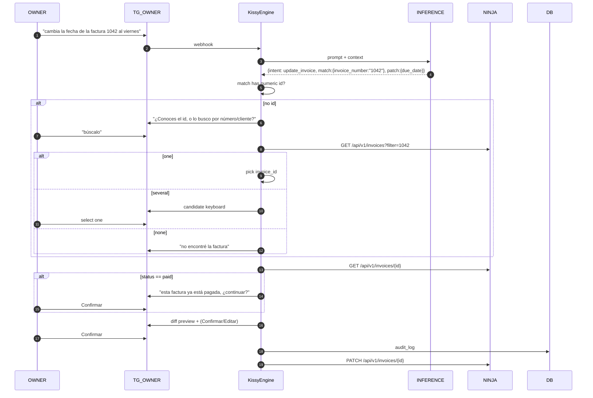
```mermaid
sequenceDiagram
    autonumber
    participant O as OWNER
    participant T as TG_OWNER
    participant K as KissyEngine
    participant I as INFERENCE
    participant N as NINJA

    O->>T: "cambia la fecha de la factura 1042 al viernes"
    T->>K: webhook
    K->>I: prompt + context
    I-->>K: {intent: update_invoice, match:{invoice_number:"1042"}, patch:{due_date}}
    K->>K: match has numeric id?
    alt no id
        K->>T: "¿Conoces el id, o lo busco por número/cliente?"
        O->>T: "búscalo"
        K->>N: GET /api/v1/invoices?filter=1042
        alt one
            K->>K: pick invoice_id
        else several
            K->>T: candidate keyboard
            O->>T: select one
        else none
            K->>T: "no encontré la factura"
        end
    end
    K->>N: GET /api/v1/invoices/{id}
    alt status == paid
        K->>T: "esta factura ya está pagada, ¿continuar?"
        O->>T: Confirmar
    end
    K->>T: diff preview + (Confirmar/Editar)
    O->>T: Confirmar
    K->>DB: audit_log
    K->>N: PATCH /api/v1/invoices/{id}
```

### UC-T-W05 · Record payment

- **Goal:** log a payment against an invoice.
- **Actors:** `OWNER`, `TG_OWNER`, `KissyEngine`, `INFERENCE`, `NINJA`.
- **Preconditions:** invoice exists; `amount ≤ outstanding` strictly (no tolerance in v1).
- **Main flow:**
  1. `OWNER` indicates invoice + amount + method + date.
  2. `INFERENCE` returns `{intent: "record_payment", params}`.
  3. `KissyEngine` validates `amount ≤ outstanding`. If exceeded → reject with explanation.
  4. Preview + `Confirmar` / `Editar`.
  5. `Confirmar` → `POST /api/v1/payments`.
- **Alt / exception flows:** invoice not found → re-ask.
- **Security & policy notes:** golden rule: the payment amount CANNOT exceed the pending balance. No exceptions in v1. Audit.
- **Diagram:**

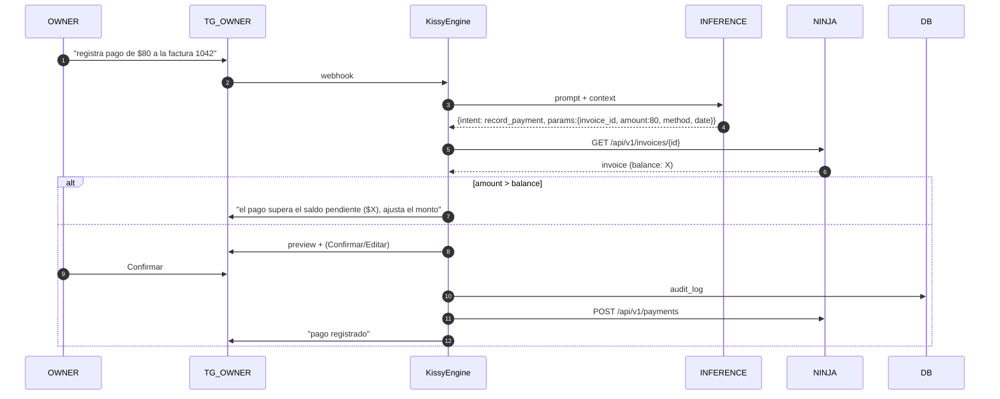
```mermaid
sequenceDiagram
    autonumber
    participant O as OWNER
    participant T as TG_OWNER
    participant K as KissyEngine
    participant I as INFERENCE
    participant N as NINJA

    O->>T: "registra pago de $80 a la factura 1042"
    T->>K: webhook
    K->>I: prompt + context
    I-->>K: {intent: record_payment, params:{invoice_id, amount:80, method, date}}
    K->>N: GET /api/v1/invoices/{id}
    N-->>K: invoice (balance: X)
    alt amount > balance
        K->>T: "el pago supera el saldo pendiente ($X), ajusta el monto"
    else
        K->>T: preview + (Confirmar/Editar)
        O->>T: Confirmar
        K->>DB: audit_log
        K->>N: POST /api/v1/payments
        K->>T: "pago registrado"
    end
```

### UC-T-W06 · Unapply payment (mark unapplied)

- **Goal:** reverse a payment without deleting it, via "mark unapplied".
- **Actors:** `OWNER`, `TG_OWNER`, `KissyEngine`, `INFERENCE`, `NINJA`.
- **Preconditions:** payment exists and is applied.
- **Main flow:**
  1. `OWNER` references the payment (or selects it from UC-T-R04).
  2. `INFERENCE` returns `{intent: "unapply_payment", params: {payment_id}}`.
  3. Preview: "se va a desaplicar el pago X de $Y de la factura Z" + `Confirmar` / `Editar`.
  4. `Confirmar` → call Ninja's unapply endpoint (NOT DELETE).
- **Alt / exception flows:** payment already unapplied → informational message. Payment belongs to a closed invoice → warning.
- **Security & policy notes:** confirmation mandatory; non-destructive operation (the row is not deleted). Audit.
- **Diagram:**

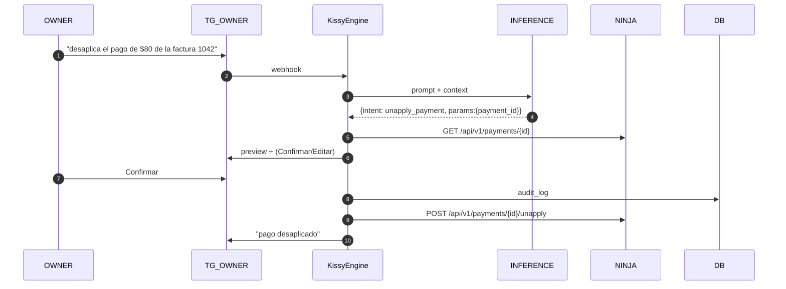
```mermaid
sequenceDiagram
    autonumber
    participant O as OWNER
    participant T as TG_OWNER
    participant K as KissyEngine
    participant I as INFERENCE
    participant N as NINJA

    O->>T: "desaplica el pago de $80 de la factura 1042"
    T->>K: webhook
    K->>I: prompt + context
    I-->>K: {intent: unapply_payment, params:{payment_id}}
    K->>N: GET /api/v1/payments/{id}
    K->>T: preview + (Confirmar/Editar)
    O->>T: Confirmar
    K->>DB: audit_log
    K->>N: POST /api/v1/payments/{id}/unapply
    K->>T: "pago desaplicado"
```

### UC-T-W07 · Create task

- **Goal:** create a task linked to a project.
- **Actors:** `OWNER`, `TG_OWNER`, `KissyEngine`, `INFERENCE`, `NINJA`.
- **Preconditions:** project resolved; `project_id` unique.
- **Main flow:**
  1. `OWNER` describes the task.
  2. `INFERENCE` returns `{intent: "create_task", params: {project_id|project_name, ...}}`.
  3. Resolve project (ambiguous → keyboard).
  4. Preview + `Confirmar` / `Editar`.
  5. `Confirmar` → `POST /api/v1/tasks`.
- **Alt / exception flows:** project does not exist → suggest creating it first (UC-T-W09) or continue the dialog.
- **Security & policy notes:** allowlisted schema; audit.
- **Diagram:**

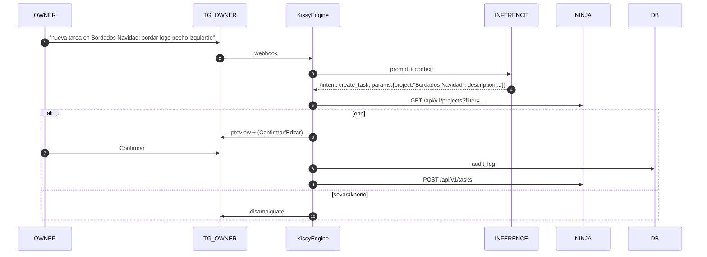
```mermaid
sequenceDiagram
    autonumber
    participant O as OWNER
    participant T as TG_OWNER
    participant K as KissyEngine
    participant I as INFERENCE
    participant N as NINJA

    O->>T: "nueva tarea en Bordados Navidad: bordar logo pecho izquierdo"
    T->>K: webhook
    K->>I: prompt + context
    I-->>K: {intent: create_task, params:{project:"Bordados Navidad", description:...}}
    K->>N: GET /api/v1/projects?filter=...
    alt one
        K->>T: preview + (Confirmar/Editar)
        O->>T: Confirmar
        K->>DB: audit_log
        K->>N: POST /api/v1/tasks
    else several/none
        K->>T: disambiguate
    end
```

### UC-T-W08 · Update task (PATCH)

- **Goal:** move a task between states, reassign, etc.
- **Actors:** `OWNER`, `TG_OWNER`, `KissyEngine`, `INFERENCE`, `NINJA`.
- **Preconditions:** task exists.
- **ID-first clarification:** same pattern as UC-T-W02. If `OWNER` does not provide the numeric `id`, `KissyEngine` asks; if not, it looks up by description, by project, or by recent list, and disambiguates via inline keyboard.
- **Main flow:**
  1. `OWNER` indicates the task + change (e.g. "marca la tarea X como completada").
  2. `INFERENCE` returns `{intent: "update_task", params: {match, patch}}`.
  3. If `match` lacks numeric id → ID-first clarification.
  4. Diff + preview + `Confirmar` / `Editar`.
  5. `PATCH /api/v1/tasks/{id}`.
- **Alt / exception flows:** ambiguous id → keyboard.
- **Security & policy notes:** PATCH only; audit.
- **Diagram:**

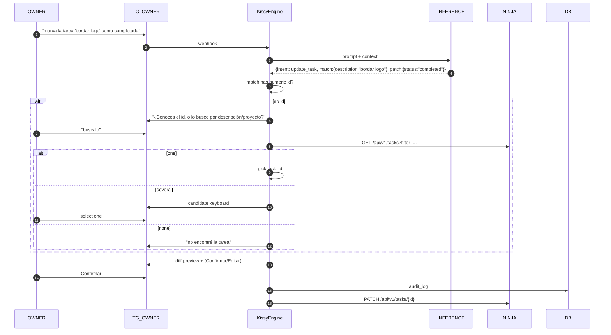
```mermaid
sequenceDiagram
    autonumber
    participant O as OWNER
    participant T as TG_OWNER
    participant K as KissyEngine
    participant I as INFERENCE
    participant N as NINJA

    O->>T: "marca la tarea 'bordar logo' como completada"
    T->>K: webhook
    K->>I: prompt + context
    I-->>K: {intent: update_task, match:{description:"bordar logo"}, patch:{status:"completed"}}
    K->>K: match has numeric id?
    alt no id
        K->>T: "¿Conoces el id, o lo busco por descripción/proyecto?"
        O->>T: "búscalo"
        K->>N: GET /api/v1/tasks?filter=...
        alt one
            K->>K: pick task_id
        else several
            K->>T: candidate keyboard
            O->>T: select one
        else none
            K->>T: "no encontré la tarea"
        end
    end
    K->>T: diff preview + (Confirmar/Editar)
    O->>T: Confirmar
    K->>DB: audit_log
    K->>N: PATCH /api/v1/tasks/{id}
```

### UC-T-W09 · Create project

- **Goal:** create a project.
- **Actors:** `OWNER`, `TG_OWNER`, `KissyEngine`, `INFERENCE`, `NINJA`.
- **Preconditions:** project name is free.
- **Main flow:**
  1. `OWNER` describes the project (client, description, dates).
  2. `INFERENCE` returns `{intent: "create_project", params, confidence}`.
  3. Preview + `Confirmar` / `Editar`.
  4. `Confirmar` → `POST /api/v1/projects`.
- **Alt / exception flows:** duplicate name → warning + suggestion.
- **Security & policy notes:** allowlisted schema; audit.
- **Diagram:**

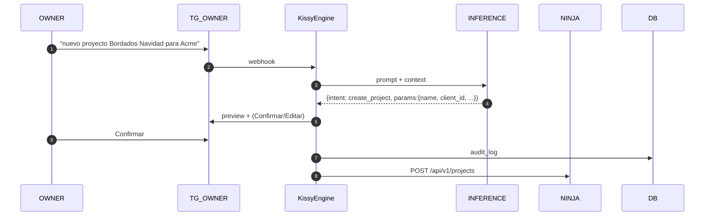
```mermaid
sequenceDiagram
    autonumber
    participant O as OWNER
    participant T as TG_OWNER
    participant K as KissyEngine
    participant I as INFERENCE
    participant N as NINJA

    O->>T: "nuevo proyecto Bordados Navidad para Acme"
    T->>K: webhook
    K->>I: prompt + context
    I-->>K: {intent: create_project, params:{name, client_id, ...}}
    K->>T: preview + (Confirmar/Editar)
    O->>T: Confirmar
    K->>DB: audit_log
    K->>N: POST /api/v1/projects
```

### UC-T-W10 · Update project (PATCH)

- **Goal:** modify a project (dates, description, status).
- **Actors:** `OWNER`, `TG_OWNER`, `KissyEngine`, `INFERENCE`, `NINJA`.
- **Preconditions:** project exists.
- **ID-first clarification:** same pattern as UC-T-W02. If `OWNER` does not provide the numeric `id`, `KissyEngine` asks; if not, it looks up by project name or by client, and disambiguates via inline keyboard.
- **Main flow:**
  1. `OWNER` references the project + change.
  2. `INFERENCE` returns `{intent: "update_project", params: {match, patch}}`.
  3. If `match` lacks numeric id → ID-first clarification.
  4. Diff + preview + `Confirmar` / `Editar`.
  5. `PATCH /api/v1/projects/{id}`.
- **Alt / exception flows:** ambiguous id → keyboard.
- **Security & policy notes:** PATCH only; audit.
- **Diagram:**

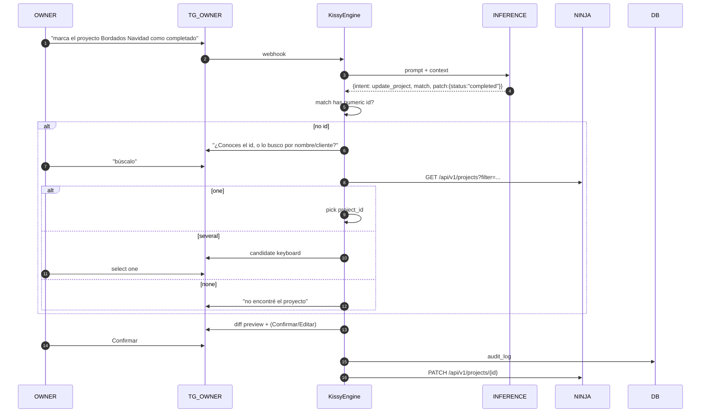
```mermaid
sequenceDiagram
    autonumber
    participant O as OWNER
    participant T as TG_OWNER
    participant K as KissyEngine
    participant I as INFERENCE
    participant N as NINJA

    O->>T: "marca el proyecto Bordados Navidad como completado"
    T->>K: webhook
    K->>I: prompt + context
    I-->>K: {intent: update_project, match, patch:{status:"completed"}}
    K->>K: match has numeric id?
    alt no id
        K->>T: "¿Conoces el id, o lo busco por nombre/cliente?"
        O->>T: "búscalo"
        K->>N: GET /api/v1/projects?filter=...
        alt one
            K->>K: pick project_id
        else several
            K->>T: candidate keyboard
            O->>T: select one
        else none
            K->>T: "no encontré el proyecto"
        end
    end
    K->>T: diff preview + (Confirmar/Editar)
    O->>T: Confirmar
    K->>DB: audit_log
    K->>N: PATCH /api/v1/projects/{id}
```

### UC-T-W11 · Create invoice for new client (composite flow)

- **Goal:** create an invoice and, if the client does not exist, create the client inline within the same flow with a single confirmation.
- **Actors:** `OWNER`, `TG_OWNER`, `KissyEngine`, `INFERENCE`, `NINJA`.
- **Preconditions:** allowlist; bot healthy.
- **Main flow:**
  1. `OWNER` sends a message naming a client + invoice (e.g. "factura para María López, 2 bordados de logo, $80").
  2. `KissyEngine` resolves the client in Ninja (exact match).
  3. **If not found** → fuzzy match with threshold 0.7 on `name`, `phone`, `email`, `rfc`, `address`. Return up to 3 candidates.
  4. Bot shows: "¿Es alguno de estos clientes? [candidates] — Ninguno, es nuevo". **Never auto-pick.**
  5. If `OWNER` selects a candidate → branch into UC-T-W03 (standard invoice).
  6. If `OWNER` confirms "es nuevo" → `INFERENCE` extracts client fields (`name` required; rest optional) by asking only for the missing ones. The choice is remembered for the lifetime of the dialog so candidates are not re-offered.
  7. `KissyEngine` computes `subtotal` and `total` server-side (no taxes in v1, see UC-T-W03) and renders a **combined preview** (client fields + invoice fields) with an inline keyboard of **only two buttons: `Confirmar` and `Editar`**. No `Cancelar`. The preview explicitly notes `Sin impuestos (calculados en una versión futura)`.
  8. If `OWNER` taps `Editar` → bot: "¿Qué quieres cambiar?" → the dialog continues; the next inference diffs against the current draft and re-renders the same combined preview.
  9. If `OWNER` taps `Confirmar` → `KissyEngine` executes `POST /api/v1/clients` and then `POST /api/v1/invoices` with the newly created `client_id`. Both writes share a `correlation_id` in `audit_log`.
- **Alt / exception flows:**
  - 30 min idle (UC-T-L02) → silent close. Nothing executes because execution is post-`Confirmar`.
  - POST client fails → abort before the invoice; show error; the dialog stays open.
  - POST client OK + POST invoice fails → compensating message: "Creé al cliente *María López* (id X), pero la factura no pudo crearse: \<\<razón\>\>. Puedes intentarlo de nuevo cuando quieras." No automatic retry.
  - Schema validation fails on client or invoice → bot asks for the missing field before re-rendering the preview.
  - 50-message cap (UC-T-L01) → fires inside this dialog.
  - Notifications (UC-N-01) → rescheduled per UC-T-L04 while the dialog is active.
- **Security & policy notes:**
  - A single confirmation gate covers both writes; a single abort window (via `Editar`).
  - Each side validates against its own allowlisted schema; fields outside the schema are dropped.
  - The composite write is the **only** allowed multi-op exception. Any other multi-intent attempt → UC-T-L03.
  - Totals ALWAYS server-side; user-supplied totals are ignored. **No tax computation in v1.**
  - `confidence` threshold applies to client and invoice; below threshold forces a clarification round before showing the preview.
  - Audit: both writes share a `correlation_id`.
- **Diagram:**

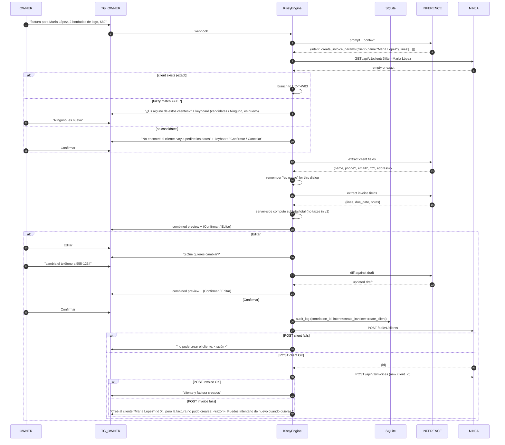
```mermaid
sequenceDiagram
    autonumber
    participant O as OWNER
    participant T as TG_OWNER
    participant K as KissyEngine
    participant DB as SQLite
    participant I as INFERENCE
    participant N as NINJA

    O->>T: "factura para María López, 2 bordados de logo, $80"
    T->>K: webhook
    K->>I: prompt + context
    I-->>K: {intent: create_invoice, params:{client:{name:"María López"}, lines:[...]}}
    K->>N: GET /api/v1/clients?filter=María López
    N-->>K: empty or exact
    alt client exists (exact)
        K->>K: branch to UC-T-W03
    else fuzzy match >= 0.7
        K->>T: "¿Es alguno de estos clientes?" + keyboard (candidates / Ninguno, es nuevo)
        O->>T: "Ninguno, es nuevo"
    else no candidates
        K->>T: "No encontré al cliente, voy a pedirte los datos" + keyboard "Confirmar / Cancelar"
        O->>T: Confirmar
    end
    K->>I: extract client fields
    I-->>K: {name, phone?, email?, rfc?, address?}
    K->>K: remember "es nuevo" for this dialog
    K->>I: extract invoice fields
    I-->>K: {lines, due_date, notes}
    K->>K: server-side compute subtotal/total (no taxes in v1)
    K->>T: combined preview + (Confirmar / Editar)
    alt Editar
        O->>T: Editar
        K->>T: "¿Qué quieres cambiar?"
        O->>T: "cambia el teléfono a 555-1234"
        K->>I: diff against draft
        I-->>K: updated draft
        K->>T: combined preview + (Confirmar / Editar)
    else Confirmar
        O->>T: Confirmar
        K->>DB: audit_log (correlation_id, intent=create_invoice+create_client)
        K->>N: POST /api/v1/clients
        alt POST client fails
            K->>T: "no pude crear el cliente: <razón>"
        else POST client OK
            N-->>K: {id}
            K->>N: POST /api/v1/invoices (new client_id)
            alt POST invoice OK
                K->>T: "cliente y factura creados"
            else POST invoice fails
                K->>T: "Creé al cliente *María López* (id X), pero la factura no pudo crearse: <razón>. Puedes intentarlo de nuevo cuando quieras."
            end
        end
    end
```

---

## 5. Telegram — Dialog lifecycle (4)

### UC-T-L01 · 50-message cap

- **Goal:** prevent endless dialogs without aborting the user's work.
- **Actors:** `OWNER`, `TG_OWNER`, `KissyEngine`, `SQLite`.
- **Preconditions:** dialog open.
- **Main flow:**
  1. On each new message, `KissyEngine` counts messages in the current dialog.
  2. If `count > 50` → bot replies literally: "Este es un resumen de lo que tengo hasta ahora: \<\<summary\>\>. Todavía falta información: \<\<missing information\>\>. ¿Puedes completar la información faltante o quieres que reinicie?"
  3. If `OWNER` says "continuar / completa / sí" → that reply counts as the **first message of a new dialog**; state (`summary`, `missing fields`) is carried into the new dialog.
  4. If `OWNER` says "reiniciar / no" → a new dialog opens with empty context.
- **Alt / exception flows:** none.
- **Security & policy notes:** the summary is generated by `INFERENCE` from the just-closed dialog. The `correlation_id` is preserved if applicable. Threshold is configured via `CONVERSATION_MSG_CAP` (default 50).
- **Diagram:**

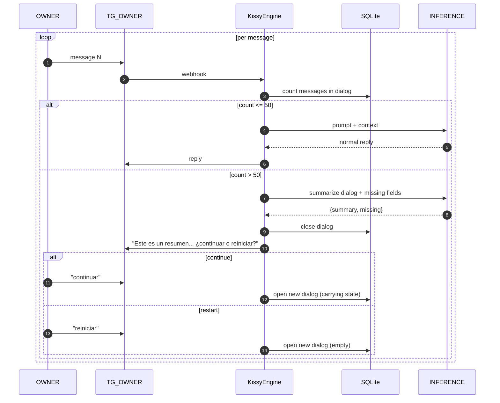
```mermaid
sequenceDiagram
    autonumber
    participant O as OWNER
    participant T as TG_OWNER
    participant K as KissyEngine
    participant DB as SQLite
    participant I as INFERENCE

    loop per message
        O->>T: message N
        T->>K: webhook
        K->>DB: count messages in dialog
        alt count <= 50
            K->>I: prompt + context
            I-->>K: normal reply
            K->>T: reply
        else count > 50
            K->>I: summarize dialog + missing fields
            I-->>K: {summary, missing}
            K->>DB: close dialog
            K->>T: "Este es un resumen... ¿continuar o reiniciar?"
            alt continue
                O->>T: "continuar"
                K->>DB: open new dialog (carrying state)
            else restart
                O->>T: "reiniciar"
                K->>DB: open new dialog (empty)
            end
        end
    end
```

### UC-T-L02 · Idle close (30 min)

- **Goal:** close stale dialogs.
- **Actors:** `Scheduler`, `SQLite`, `KissyEngine`.
- **Preconditions:** `SCHEDULER` active.
- **Main flow:**
  1. `SCHEDULER` runs a sweep every N minutes.
  2. Closes dialogs with `last_msg_at < now - 30min` and `status = open`.
  3. The next `OWNER` message opens a new dialog.
- **Alt / exception flows:** none.
- **Security & policy notes:** no data is deleted in this step; only `status` changes.
- **Diagram:**

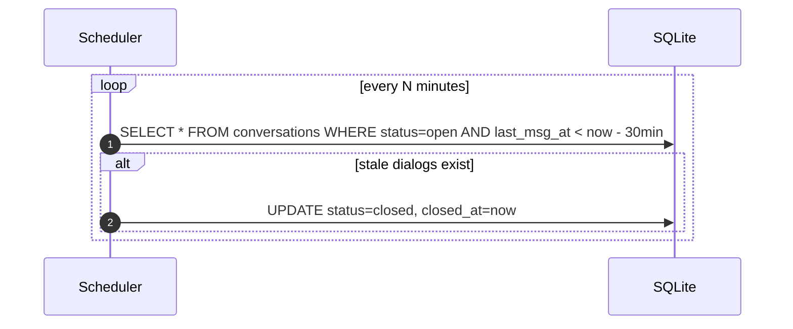
```mermaid
sequenceDiagram
    autonumber
    participant S as Scheduler
    participant DB as SQLite

    loop every N minutes
        S->>DB: SELECT * FROM conversations WHERE status=open AND last_msg_at < now - 30min
        alt stale dialogs exist
            S->>DB: UPDATE status=closed, closed_at=now
        end
    end
```

### UC-T-L03 · Multi-intent detected

- **Goal:** gracefully handle detection of two intents (when it is NOT UC-T-W11).
- **Actors:** `OWNER`, `TG_OWNER`, `KissyEngine`, `INFERENCE`.
- **Preconditions:** active dialog.
- **Main flow:**
  1. `INFERENCE` returns `intents: [a, b]` or the dispatcher detects two intents across consecutive messages.
  2. `KissyEngine` finalizes the current intent with: "Listo, ahora enfoquémonos en la siguiente tarea".
  3. Opens a new dialog and continues with the second intent.
- **Alt / exception flows:** if the first intent still requires a mandatory field, abort it first and then handle the second.
- **Security & policy notes:** the `correlation_id` of the first intent stays in `audit_log`.
- **Diagram:**

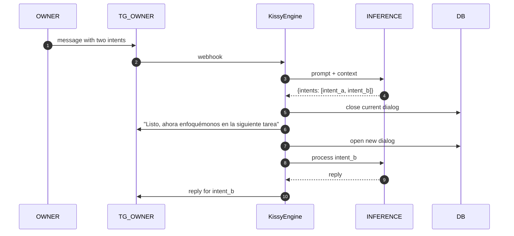
```mermaid
sequenceDiagram
    autonumber
    participant O as OWNER
    participant T as TG_OWNER
    participant K as KissyEngine
    participant I as INFERENCE

    O->>T: message with two intents
    T->>K: webhook
    K->>I: prompt + context
    I-->>K: {intents: [intent_a, intent_b]}
    K->>DB: close current dialog
    K->>T: "Listo, ahora enfoquémonos en la siguiente tarea"
    K->>DB: open new dialog
    K->>I: process intent_b
    I-->>K: reply
    K->>T: reply for intent_b
```

### UC-T-L04 · Notifications vs active dialog

- **Goal:** prevent notifications from interrupting the user while typing.
- **Actors:** `Scheduler`, `KissyEngine`, `SQLite`, `TG_OWNER`.
- **Preconditions:** daily/weekly summary scheduled.
- **Main flow:**
  1. At the scheduled time (08:30), `Scheduler` checks whether `OWNER` has an open dialog.
  2. If an open dialog exists → reschedule +5 min; increment `reschedule_count`.
  3. If `reschedule_count > 3` → enqueue and deliver after `OWNER`'s next turn.
  4. If no open dialog → deliver immediately.
- **Alt / exception flows:** if after several retries the dialog is still open, the notification is dropped for that day and recorded in `audit_log`.
- **Security & policy notes:** the notification never aborts an active dialog.
- **Diagram:**

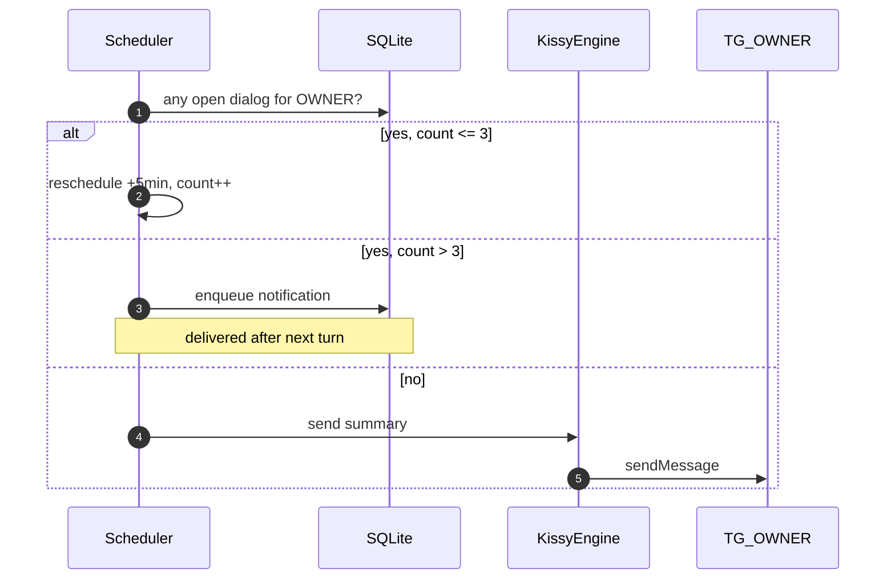
```mermaid
sequenceDiagram
    autonumber
    participant S as Scheduler
    participant DB as SQLite
    participant K as KissyEngine
    participant T as TG_OWNER

    S->>DB: any open dialog for OWNER?
    alt yes, count <= 3
        S->>S: reschedule +5min, count++
    else yes, count > 3
        S->>DB: enqueue notification
        Note over S,DB: delivered after next turn
    else no
        S->>K: send summary
        K->>T: sendMessage
    end
```

---

## 6. Notifications (1 + on-demand command)

### UC-N-01 · Monday 08:30 summary (weekly + daily)

- **Goal:** deliver to `OWNER` the weekly summary (Monday only) followed by the daily summary.
- **Actors:** `Scheduler`, `KissyEngine`, `NINJA`, `TG_OWNER`.
- **Preconditions:** bot healthy.
- **Main flow:**
  1. `Scheduler` triggers on Monday at 08:30.
  2. `KissyEngine` queries Ninja for:
     - **Weekly (Monday only):** tasks completed in the last 7 days; projects finished; weekly income; upcoming due dates ≤7 days.
     - **Daily:** pending tasks; clients with debt; open projects.
  3. Renders the message in this order: weekly sections → daily sections.
  4. Respects UC-T-L04 (reschedule if an active dialog exists, K=3).
- **Alt / exception flows:** Ninja error → degraded message "no pude obtener X".
- **Security & policy notes:** push-only; no sensitive buttons (only `Ver detalle` which triggers an UC-T-Rxx).
- **Diagram:**

```mermaid
sequenceDiagram
    autonumber
    participant S as Scheduler
    participant K as KissyEngine
    participant N as NINJA
    participant DB as SQLite
    participant T as TG_OWNER

    S->>DB: any open dialog?
    alt yes (UC-T-L04)
        S->>S: reschedule
    else no
        S->>K: trigger Monday summary
        K->>N: queries (tasks/projects/invoices/payments)
        N-->>K: data
        K->>K: compose (weekly sections first, then daily)
        K->>T: sendMessage
    end
```

### UC-N-01b · On-demand summary

- **Goal:** let `OWNER` request the summary at any time.
- **Actors:** `OWNER`, `TG_OWNER`, `KissyEngine`, `NINJA`.
- **Preconditions:** allowlist.
- **Main flow:**
  1. `OWNER` sends `/diario` or equivalent natural-language ("muéstrame el resumen").
  2. `KissyEngine` runs the same pipeline as UC-N-01.
  3. If today is Monday → includes weekly sections; otherwise → daily only.
- **Alt / exception flows:** rate limit (UC-ADM-01) — but the user can still ask manually beyond the threshold.
- **Security & policy notes:** read-only.
- **Diagram:**

```mermaid
sequenceDiagram
    autonumber
    participant O as OWNER
    participant T as TG_OWNER
    participant K as KissyEngine
    participant I as INFERENCE
    participant N as NINJA

    O->>T: "/diario" or "muéstrame el resumen"
    T->>K: webhook
    K->>I: classify intent
    I-->>K: {intent: send_summary, scope:daily_or_auto}
    K->>N: queries
    N-->>K: data
    K->>T: sendMessage
```

---

## 7. Streamlit — Authentication (3)

### UC-S-A01 · Claim Google account via Telegram

- **Goal:** `OWNER` binds their Google identity without sysadmin intervention.
- **Actors:** `OWNER`, `TG_OWNER`, `KissyEngine`, `Streamlit`, `Google`.
- **Preconditions:** `OWNER`'s phone is allowlisted.
- **Main flow:**
  1. `OWNER` sends `/vincular google <email>` on Telegram.
  2. `KissyEngine` generates a signed claim token, TTL 1 h, and stores it in `claims` with `telegram_chat_id` and `expected_email`.
  3. `OWNER` opens Streamlit; the claim screen shows: "abre Telegram y confirma con /vincular google <email>".
  4. `OWNER` completes Google OAuth; the resulting email must match `expected_email`.
  5. Streamlit sends the token + email to `KissyEngine` for verification.
  6. `KissyEngine` validates the token (not expired, single-use, email match) and stores `owner_google_email`.
- **Alt / exception flows:**
  - Token expired (>1 h) → re-run `/vincular`.
  - Google email ≠ `expected_email` → reject + message.
  - A different `owner_google_email` is already registered → reject + alert `SYSADMIN`.
  - Token already used → reject.
- **Security & policy notes:** single-use; TTL 1 h; only the allowlisted phone can initiate the claim.
- **Diagram:**

```mermaid
sequenceDiagram
    autonumber
    participant O as OWNER
    participant T as TG_OWNER
    participant K as KissyEngine
    participant DB as SQLite
    participant S as Streamlit
    participant G as Google

    O->>T: "/vincular google maria@example.com"
    T->>K: webhook
    K->>DB: insert claim (token, chat_id, expected_email, exp=now+1h)
    K->>T: "claim generado, abre Streamlit"
    O->>S: open Streamlit
    S->>G: OAuth flow
    G-->>S: email
    S->>K: POST /verify-claim {token, email}
    K->>DB: validate token (exp, single-use, email match)
    alt ok
        K->>DB: store owner_google_email
        K->>S: 200 OK
        S-->>O: dashboard
    else exp/used/email mismatch
        K->>S: 401
        S-->>O: "re-ejecuta /vincular"
    end
```

### UC-S-A02 · Production login

- **Goal:** single sign-on via Google OAuth in production.
- **Actors:** `OWNER`, `Streamlit`, `Google`, `KissyEngine`.
- **Preconditions:** `owner_google_email` registered (UC-S-A01).
- **Main flow:**
  1. `OWNER` opens Streamlit.
  2. OAuth with Google.
  3. The callback email must be `== owner_google_email`.
  4. Session is httpOnly, SameSite=Strict.
- **Alt / exception flows:** different email → reject.
- **Security & policy notes:** httpOnly cookie + SameSite=Strict; behind a TLS-terminating proxy in production.
- **Diagram:**

```mermaid
sequenceDiagram
    autonumber
    participant O as OWNER
    participant S as Streamlit
    participant G as Google
    participant K as KissyEngine
    participant DB as SQLite

    O->>S: open dashboard
    S->>G: OAuth
    G-->>S: email
    S->>K: validate email
    K->>DB: read owner_google_email
    alt match
        K->>S: session OK
        S-->>O: dashboard
    else mismatch
        K->>S: 403
        S-->>O: "esta cuenta no está autorizada"
    end
```

### UC-S-A03 · Development mode (password authentication)

- **Goal:** allow local testing without configuring Google OAuth.
- **Actors:** `OWNER`, `Streamlit`, `KissyEngine`.
- **Preconditions:** `APP_ENV=development`; `DEV_DASHBOARD_PASSWORD` set in `.env`.
- **Main flow:**
  1. `OWNER` opens Streamlit.
  2. The form asks for `DEV_DASHBOARD_PASSWORD`.
  3. If it matches → session (same cookies as UC-S-A02).
  4. Streamlit logs `auth_method=password` in `audit_log`.
- **Alt / exception flows:** wrong password → 401. `APP_ENV=production` → this UC is NOT available.
- **Security & policy notes:** password from env var; never logged; fail-fast if not configured.
- **Diagram:**

```mermaid
sequenceDiagram
    autonumber
    participant O as OWNER
    participant S as Streamlit
    participant K as KissyEngine
    participant DB as SQLite

    S->>K: get env APP_ENV
    alt APP_ENV == development
        S-->>O: password form
        O->>S: password
        S->>K: verify DEV_DASHBOARD_PASSWORD
        alt ok
            K->>DB: audit_log (auth_method=password)
            K->>S: session OK
            S-->>O: dashboard
        else ko
            K->>S: 401
        end
    else APP_ENV == production
        S->>S: redirect to OAuth (UC-S-A02)
    end
```

---

## 8. Streamlit — Kanban and verification (3)

### UC-S-K01 · View Kanban board

- **Goal:** view tasks grouped by project and status.
- **Actors:** `OWNER`, `Streamlit`, `NINJA`.
- **Preconditions:** valid Streamlit session.
- **Main flow:**
  1. Streamlit queries Ninja: `GET /api/v1/tasks?...`.
  2. Groups by `project_id` and `status_id`.
  3. Renders drag-and-drop columns.
- **Alt / exception flows:** Ninja error → banner "no pude cargar tareas".
- **Security & policy notes:** read-only in this UC; moves trigger UC-S-K02.
- **Diagram:**

```mermaid
sequenceDiagram
    autonumber
    participant O as OWNER
    participant S as Streamlit
    participant N as NINJA

    O->>S: open Kanban
    S->>N: GET /api/v1/tasks
    N-->>S: tasks
    S->>S: group and render
    S-->>O: board
```

### UC-S-K02 · Move task across columns (PATCH)

- **Goal:** update a task's status via drag-and-drop.
- **Actors:** `OWNER`, `Streamlit`, `NINJA`.
- **Preconditions:** valid session.
- **Main flow:**
  1. `OWNER` drags a card to another column.
  2. Streamlit does `PATCH /api/v1/tasks/{id}` with only the new `status_id`.
  3. `audit_log` records the change.
- **Alt / exception flows:** error → visual rollback.
- **Security & policy notes:** PATCH only with `status_id`; nothing else is modified from the Kanban.
- **Diagram:**

```mermaid
sequenceDiagram
    autonumber
    participant O as OWNER
    participant S as Streamlit
    participant N as NINJA
    participant K as KissyEngine
    participant DB as SQLite

    O->>S: drag card to "completado" column
    S->>K: PATCH task {status_id: completed}
    K->>DB: audit_log
    K->>N: PATCH /api/v1/tasks/{id}
    alt ok
        N-->>K: 200
        K->>S: 200
    else error
        K->>S: error
        S->>S: visual rollback
    end
```

### UC-S-K04 · Verify component health

- **Goal:** administrative status view.
- **Actors:** `OWNER`, `Streamlit`, `KissyEngine`, `NINJA`, `INFERENCE`, `SQLite`.
- **Preconditions:** valid session.
- **Main flow:**
  1. Streamlit asks `KissyEngine` for the status of each component.
  2. Renders green/red badges + latency.
- **Alt / exception flows:** a down component → visible alert.
- **Security & policy notes:** read-only.
- **Diagram:**

```mermaid
sequenceDiagram
    autonumber
    participant O as OWNER
    participant S as Streamlit
    participant K as KissyEngine
    participant N as NINJA
    participant I as INFERENCE
    participant DB as SQLite

    S->>K: health()
    par parallel
        K->>N: GET /api/v1/ping
    and
        K->>I: GET /api/tags
    and
        K->>DB: SELECT 1
    end
    K->>S: {ninja: ok, inference: ok, db: ok}
    S-->>O: badges
```

---

## 9. Administration and abuse (6)

All admin UCs run on the **SYSADMIN bot** (`TG_ADMIN`). `SYSADMIN`'s phone is allowlisted via a separate variable (`SYSADMIN_PHONE_ALLOWLIST`). The OWNER bot rejects any administrative command.

### UC-ADM-01 · Rate-limit alert (>100 msgs/min)

- **Goal:** detect webhook abuse.
- **Actors:** `Scheduler`/`KissyEngine`, `TG_ADMIN`.
- **Preconditions:** rate-limiter active.
- **Main flow:**
  1. Rate-limiter counts messages per chat per minute.
  2. If `> 100` → return 429 to the chat; alert `TG_ADMIN`: "Abuso detectado: chat X, Y msgs/min".
  3. `audit_log` records the event.
- **Alt / exception flows:** none.
- **Security & policy notes:** single configurable global threshold.
- **Diagram:**

```mermaid
sequenceDiagram
    autonumber
    participant R as RateLimiter
    participant K as KissyEngine
    participant T as TG_ADMIN
    participant DB as SQLite

    R->>K: count msgs/min
    alt > 100
        K->>DB: audit_log
        K->>T: sendMessage (alert)
    end
```

### UC-ADM-02 · Alert >20 dialogs/day

- **Goal:** detect anomalous usage.
- **Actors:** `Scheduler`, `KissyEngine`, `TG_ADMIN`.
- **Preconditions:** counter active.
- **Main flow:**
  1. At midnight, `Scheduler` counts dialogs opened during the day per chat.
  2. If `> 20` → alert `TG_ADMIN`.
- **Alt / exception flows:** none.
- **Security & policy notes:** the threshold counts started dialogs, not messages.
- **Diagram:**

```mermaid
sequenceDiagram
    autonumber
    participant S as Scheduler
    participant DB as SQLite
    participant K as KissyEngine
    participant T as TG_ADMIN

    S->>DB: count conversations opened today by chat
    alt count > 20
        S->>K: alert
        K->>T: sendMessage
    end
```

### UC-ADM-03 · Alert non-allowlisted operation attempt

- **Goal:** detect prompt injection or model drift.
- **Actors:** `KissyEngine`, `TG_ADMIN`.
- **Preconditions:** dispatcher active.
- **Main flow:**
  1. The dispatcher rejects an intent not in the allowlist.
  2. Logs in `audit_log` (with redacted params).
  3. Sends an alert to `TG_ADMIN`.
- **Alt / exception flows:** none.
- **Security & policy notes:** PII redaction in the alert.
- **Diagram:**

```mermaid
sequenceDiagram
    autonumber
    participant K as KissyEngine
    participant DB as SQLite
    participant T as TG_ADMIN

    K->>K: dispatcher rejects intent
    K->>DB: audit_log (redacted)
    K->>T: sendMessage (alert)
```

### UC-ADM-04 · Health-check failure alert

- **Goal:** notify on any component failure.
- **Actors:** `Scheduler`, `KissyEngine`, `TG_ADMIN`.
- **Preconditions:** heartbeats active.
- **Main flow:**
  1. `Scheduler` runs health checks every N minutes.
  2. If a component fails → immediate alert to `TG_ADMIN`.
- **Alt / exception flows:** the component may auto-recover; the next successful check closes the alert.
- **Security & policy notes:** do not expose secrets in the alert.
- **Diagram:**

```mermaid
sequenceDiagram
    autonumber
    participant S as Scheduler
    participant K as KissyEngine
    participant N as NINJA
    participant I as INFERENCE
    participant DB as SQLite
    participant T as TG_ADMIN

    loop every N minutes
        S->>K: health()
        K->>N: ping
        K->>I: ping
        K->>DB: ping
        K-->>S: results
        alt any component down
            S->>T: sendMessage (alert)
        end
    end
```

### UC-ADM-05 · Admin command: query allowlist / change `owner_google_email`

- **Goal:** manual management of the allowlist and the linked Google identity.
- **Actors:** `SYSADMIN`, `TG_ADMIN`, `KissyEngine`, `SQLite`.
- **Preconditions:** `SYSADMIN`'s chat is allowlisted.
- **Main flow:**
  1. `SYSADMIN` sends `/allowlist` or `/set-owner-email <new>`.
  2. `KissyEngine` validates that the chat is admin.
  3. Executes the action (read or change).
  4. Replies with confirmation.
- **Alt / exception flows:** attempt from a non-admin chat → silent rejection + alert.
- **Security & policy notes:** changing `owner_google_email` invalidates the previous Streamlit session (force re-login).
- **Diagram:**

```mermaid
sequenceDiagram
    autonumber
    participant SA as SYSADMIN
    participant T as TG_ADMIN
    participant K as KissyEngine
    participant DB as SQLite

    SA->>T: "/set-owner-email nuevo@example.com"
    T->>K: command
    K->>K: validate chat is admin
    alt admin
        K->>DB: update owner_google_email
        K->>DB: audit_log
        K->>T: "actualizado"
    else not admin
        K->>DB: audit_log (reject)
        K->>T: (no reply)
    end
```

### UC-ADM-06 · Bind SYSADMIN (separate bot)

- **Goal:** configure the sysadmin's phone and bot.
- **Actors:** `SYSADMIN`, `TG_ADMIN`, `KissyEngine`, `SQLite`.
- **Preconditions:** `BOT_TOKEN_ADMIN` configured in `.env`.
- **Main flow:**
  1. `SYSADMIN` contacts the admin bot for the first time.
  2. `KissyEngine` requires a bind command (`/bind <code>`) with a single-use rotating code.
  3. On validation, `chat_id` and phone are stored as `SYSADMIN_PHONE_ALLOWLIST`.
- **Alt / exception flows:** invalid/expired code → reject.
- **Security & policy notes:** this UC is the only way to register `SYSADMIN`. The first bind requires SSH access to `.env` to generate the initial code.
- **Diagram:**

```mermaid
sequenceDiagram
    autonumber
    participant SA as SYSADMIN
    participant T as TG_ADMIN
    participant K as KissyEngine
    participant DB as SQLite

    Note over SA,DB: sysadmin generates initial code via SSH (out-of-band)
    SA->>T: "/bind ABC123"
    T->>K: command
    K->>DB: validate code (single-use, expiry)
    alt ok
        K->>DB: store SYSADMIN_PHONE_ALLOWLIST
        K->>DB: audit_log
        K->>T: "bind exitoso"
    else ko
        K->>T: "código inválido"
    end
```

---

## 10. Data lifecycle (3)

### UC-DL-01 · Idle close

- **Goal:** close stale dialogs (operational alias of UC-T-L02; listed here for lifecycle completeness).
- **Actors:** `Scheduler`, `SQLite`.
- **Preconditions:** `Scheduler` active.
- **Main flow:** identical to UC-T-L02.
- **Alt / exception flows:** none.
- **Security & policy notes:** nothing is deleted in this step.
- **Diagram:** see UC-T-L02.

### UC-DL-02 · Purge closed dialogs (N=30 days)

- **Goal:** limit PII retention.
- **Actors:** `Scheduler`, `SQLite`.
- **Preconditions:** `Scheduler` active.
- **Main flow:**
  1. `Scheduler` runs daily.
  2. `DELETE FROM conversations WHERE status=closed AND closed_at < now - 30d`.
  3. Logs the purged count.
- **Alt / exception flows:** if the DB is locked → retry on the next cycle.
- **Security & policy notes:** `audit_log` is kept separately (not purged by this UC).
- **Diagram:**

```mermaid
sequenceDiagram
    autonumber
    participant S as Scheduler
    participant DB as SQLite

    S->>DB: DELETE WHERE status=closed AND closed_at < now - 30d
    DB-->>S: rows_deleted
    S->>S: log count
```

### UC-DL-03 · Manual DB backup

- **Goal:** operational backup outside automated flows.
- **Actors:** `SYSADMIN`, `SQLite` (filesystem).
- **Preconditions:** SSH access to the host.
- **Main flow:**
  1. `SYSADMIN` runs `scripts/db/backup.sh` over SSH.
  2. The script copies `data/conversations.db` to a timestamped file.
- **Alt / exception flows:** none.
- **Security & policy notes:** the backup file must live outside the repo and have mode 600 permissions.
- **Diagram:**

```mermaid
sequenceDiagram
    autonumber
    participant SA as SYSADMIN
    participant FS as Filesystem

    SA->>FS: scripts/db/backup.sh
    FS->>FS: cp data/conversations.db data/backups/<ts>.db
    FS-->>SA: ok
```

---

## 11. Deferred (2)

### UC-DEFER-V01 · Transcribe voice note

- **Status:** deferred. Placeholder for future implementation.
- **Diagram:**

```mermaid
sequenceDiagram
    autonumber
    participant O as OWNER
    participant T as TG_OWNER
    participant K as KissyEngine
    participant AS as ASR (future)

    O->>T: voice note
    T->>K: voice update
    K->>AS: transcribe
    AS-->>K: text
    K->>K: continue as text message
```

### UC-DEFER-K03 · Time logging (Streamlit)

- **Status:** deferred. Placeholder for future implementation (Streamlit UI to log time per project/task).
- **Diagram:**

```mermaid
sequenceDiagram
    autonumber
    participant O as OWNER
    participant S as Streamlit
    participant N as NINJA

    O->>S: time form (project, task, duration, date, note)
    S->>N: POST /api/v1/time_logs
    N-->>S: ok
    S-->>O: accumulated total updated
```

---

## 12. Out of scope (v1)

- Multi-tenant / multi-user (beyond `OWNER` and `SYSADMIN`).
- Multi-currency and FX conversion.
- Inventory.
- E-commerce.
- Payroll.
- Custom tax calculations (Ninja handles them).
- Native mobile app.
- Notifications outside Telegram.
- Destructive operations (`DELETE`) — only mark-unapplied for payments.
- Voice messages (UC-DEFER-V01).
- Time logging in Streamlit (UC-DEFER-K03).
- Inbound webhooks to KissyEngine from external services.

---

## 13. Cross-cutting security & policy notes

- **OWNER allowlist:** a single phone (`OWNER_PHONE_ALLOWLIST`). The OWNER bot only responds to that chat.
- **OWNER display name:** `USER_NAME` env var (first name preferred, full name acceptable). The bot addresses `OWNER` by name in greetings, summaries, and notifications. Falls back to a neutral address (e.g. `Buenas,`) if unset.
- **SYSADMIN allowlist:** a single phone (`SYSADMIN_PHONE_ALLOWLIST`) on the SYSADMIN bot (`BOT_TOKEN_ADMIN`). Admin commands are only accepted from that chat.
- **Streamlit SSO:** authentication varies by environment:
  - Production: Google OAuth (UC-S-A02) accepting only `owner_google_email`.
  - Development: `DEV_DASHBOARD_PASSWORD` from env (UC-S-A03). `APP_ENV=production` disables this path.
- **`owner_google_email` change:** only `SYSADMIN` via UC-ADM-05; `OWNER` cannot self-rebind.
- **Google claim token:** TTL 1 h, single-use, email must match in the OAuth callback.
- **LLM contract:** strict JSON `{intent, params, confidence}`. Only the code-level dispatcher allowlisted in code calls Ninja; the LLM never invokes endpoints directly.
- **Confirmations:** every write shows a preview + `Confirmar` / `Editar`. `Editar` → "¿Qué quieres cambiar?". `Cancelar` does not exist in composite flows.
- **ID-first clarification (all PATCH ops):** when `OWNER` does not provide the numeric Ninja id, `KissyEngine` asks whether they know it; if not, it looks the resource up (by natural key such as name/number/description/client) and disambiguates via inline keyboard before showing the diff preview.
- **Multi-op exception:** only UC-T-W11 (new client + invoice) composes two writes with a single confirmation.
- **Client field policy (UC-T-W01):** `name` and `phone` are mandatory. `cedula` and `address` are strongly suggested: the bot asks for each but proceeds if `OWNER` skips, surfacing them as warning rows in the preview.
- **Invoice computation (UC-T-W03, UC-T-W11):** server computes `subtotal` and `total` from line items. **No taxes in v1.** Tax computation is planned for a future version.
- **Rate limit:** 100 msgs/min per chat → 429 + admin alert (UC-ADM-01).
- **Dialog cap:** 50 messages → summary+missing prompt (UC-T-L01); no auto-restart.
- **Inactivity:** 30 min without messages → silent close (UC-T-L02/UC-DL-01).
- **Retention:** closed dialogs purged at `closed_at + 30d` (UC-DL-02). `audit_log` is kept separately.
- **Audit:** every write (including composite with `correlation_id`) goes to `audit_log`. Append-only table via SQLite triggers.
- **Secrets:** `.env` mode 600, SSH access. Never logged, never sent to the user.
- **Network exposure (current):** private local network; only Telegram webhooks (OWNER + ADMIN) are exposed via a TLS-terminating reverse proxy. Ollama on the private LAN.
- **Inference Provider:** abstract interface; Ollama today; OpenAI/Google tomorrow. The change must not affect use cases.
- **Localization:** Spanish on all user-facing surfaces. The bot can explain Ninja terms in plain Spanish when `OWNER` asks.
- **Ninja taxonomy:** passed through as-is; the system does not redefine it.

---

## 14. Appendix A — Environment variables (reference)

These variables support the use cases. **This appendix is reference; changes to `.env.example` are managed separately.**

| Variable | Supports UC | Description |
|---|---|---|
| `BOT_TOKEN` | Telegram OWNER | Token of the OWNER bot. |
| `BOT_TOKEN_ADMIN` | UC-ADM-* | Token of the SYSADMIN bot (separate instance). |
| `WEBHOOK_URL` | Telegram OWNER | Public URL for the OWNER webhook. |
| `WEBHOOK_URL_ADMIN` | Telegram ADMIN | Public URL for the ADMIN webhook. |
| `WEBHOOK_LISTEN`, `WEBHOOK_PORT` | Generic bot | Webhook bind. |
| `WEBHOOK_SECRET_TOKEN` | Generic bot | `X-Telegram-Bot-Api-Secret-Token` header. |
| `OLLAMA_HOST`, `OLLAMA_MODEL` | UC-T-R/W, UC-T-L01 | Current inference. |
| `INFERENCE_PROVIDER` | UC-T-R/W | `ollama` (default) \| `openai` \| `google`. |
| `INVOICENINJA_BASE_URL`, `INVOICE_NINJA_TOKEN` | UC-T-R/W, UC-S-K*, UC-ADM-04 | Ninja client. |
| `OWNER_PHONE_ALLOWLIST` | UC-T-* | Allowlisted phone for `OWNER`. |
| `USER_NAME` | cross-cutting | Display name used by the bot to address `OWNER`. |
| `SYSADMIN_PHONE_ALLOWLIST` | UC-ADM-* | Allowlisted phone for `SYSADMIN`. |
| `OWNER_GOOGLE_EMAIL` | UC-S-A01/A02 | Linked Google email (written by UC-ADM-05). |
| `DEV_DASHBOARD_PASSWORD` | UC-S-A03 | Password for Streamlit auth in dev. |
| `APP_ENV` | UC-S-A02/A03 | `production` \| `development`. |
| `CONVERSATION_MSG_CAP=50` | UC-T-L01 | Dialog cap. |
| `CONVERSATION_IDLE_MINUTES=30` | UC-T-L02 | Idle close. |
| `CONVERSATION_RETENTION_DAYS=30` | UC-DL-02 | Closed-dialog retention. |
| `RATE_LIMIT_PER_MINUTE=100` | UC-ADM-01 | Per-chat rate limit. |
| `DAILY_DIALOG_ABUSE_THRESHOLD=20` | UC-ADM-02 | Dialogs/day threshold. |
| `SUMMARY_HOUR=8`, `SUMMARY_MINUTE=30` | UC-N-01 | Summary time. |
| `SUMMARY_RESCHEDULE_MAX=3` | UC-T-L04 | Max reschedules. |
| `CLAIM_TOKEN_TTL_MINUTES=60` | UC-S-A01 | Claim token TTL. |